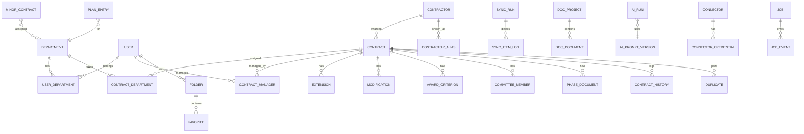

# 04 — Model de dades v2

PostgreSQL 16. Convencions: noms en **anglès** i `snake_case`; PK `id BIGINT GENERATED ALWAYS AS IDENTITY`; `created_at`/`updated_at` (trigger) a totes les taules; FK amb `ON DELETE` explícit; migracions amb Alembic. Els noms de camp de negoci catalans de la font (Socrata) es mapegen al connector, no a la BD.

## 1. Diagrama d'entitats (resum)

## 2. Nucli de contractació

### `contracts`
Manté la clau natural v1 i el gruix de camps, reorganitzats:

| Grup | Camps |
|---|---|
| Identitat | `file_code` (codi_expedient), `status` (estat_actual), `lot`, **UNIQUE(file_code, status, lot)**; `source` enum `local\|external`; `gestiona_file_id`, `ine10_code`, `dir3_code` |
| Bàsics | `subject`, `contract_type`, `procedure`, `processing_type` |
| Adjudicatari | `contractor_id FK → contractors` 🔁 (la v1 duplicava nom/NIF a cada fila; v2 normalitza, conservant `raw_contractor_name` per traçabilitat) |
| Imports | `tender_amount`, `award_amount`, `award_amount_vat`, `estimated_value`, `budget_no_vat`, `budget_vat` (NUMERIC(15,2)) |
| Dates | `published_at`, `updated_at_source`, `formalized_at`, `start_date`, `end_date`, `calculated_end_date`, notice dates (`prior/tender/award/formalization_notice_date`), `cancellation_date` |
| Durada/alertes | `duration_months`, `expiry_warning` bool, `possibly_finished` bool, `warning_months_override` |
| Classificació | `cpv_code`, `cpv_description`, `nuts_code`, `nuts_description`, `financing` |
| Enllaços | `links JSONB` (perfil, publicació, plataforma, anuncis) 🔁 (v1: 7 columnes) |
| Fase-JSON | `phase_urls JSONB` (futura/agregada/cpm/previ/licitacio/avaluacio/adjudicacio/formalitzacio/anulacio) 🔁 (v1: 9 columnes) |
| Enriquiment | `enrichment JSONB` + columnes promocionades les que es filtren/mostren en llistes: `received_offers`, `is_harmonized`, `allows_extensions`, `allows_modifications`, `social_reserve`, `subcontracting_allowed`, `enriched_at` |
| Control | `internal_status` enum `normal\|pending_review\|approved\|rejected`; `content_hash` (sha256), `raw JSONB`, `first_synced_at`, `last_synced_at` |

Índexs: `file_code`, `status`, `contractor_id`, `start_date`, `calculated_end_date`, `cpv_code`, `internal_status`, `source`, GIN sobre `raw` i trigram sobre `subject`.

### `minor_contracts`
Com v1: `file_code UNIQUE`, `contract_type`, `description`, `contractor_id FK`, `award_amount`, `award_date`, `fiscal_year`, durada (`years/months/days`), liquidació (`settlement_type`, `settlement_date`, `settlement_amount`), `internal_status`, `raw_award JSONB`, `raw_settlement JSONB`, `last_synced_at`. M2M `minor_contract_departments`.

### `contractors` (nova, normalitza adjudicataris)
`id`, `canonical_name`, `tax_id` (NIF, index), `nationality`, `company_type`, `third_sector` bool, `phone`, `email`. Vistes materialitzades o consultes agregades per al rànquing (contractes + imports, majors i menors).
- `contractor_aliases`: `alias UNIQUE`, `contractor_id FK` — aplicat a la ingesta.
- `contractor_duplicates`: parells detectats (mateix `tax_id`, nom diferent) amb `status pending|merged|rejected`, `resolved_by`, `resolved_at`. **La detecció es genera a cada sync** (defecte v1 corregit).

### Satèl·lits de contracte
- `extensions` (pròrrogues): `contract_id`, `number`, `start_date`, `end_date`, `amount`, `fiscal_year`, `raw JSONB`; UNIQUE(contract_id, number).
- `modifications`: `contract_id`, `number`, `approved_at`, `type`, `amount`, termini (y/m/d), `raw`; UNIQUE(contract_id, number).
- `award_criteria`: `contract_id`, `position`, `name`, `weight NUMERIC(7,2)`, `breakdown JSONB`.
- `committee_members`: `contract_id`, `first_name`, `last_name`, `role`.
- `phase_documents`: `contract_id`, `phase` enum, `doc_type`, `title`, `source_doc_id`, `source_hash`, `size`, `download_url`, `storage_key` (còpia local a object storage, nullable), `indexed_at` (RAG).
- `contract_history`: `contract_id`, `field`, `old_value`, `new_value`, `user_id NULL`, `change_type` enum `sync|manual|validation|gestiona_webhook`, `changed_at`.

### `duplicates`
Com v1: `contract_id_1/2`, `matched_on`, `reason`, `status pending|approved|rejected|merged`, `action_taken`, `validated_by`, `validated_at`, `notes`; UNIQUE del parell.

### `association_rules`
Com v1: `department_id`, `rule_type department|body|keyword|cpv|amount`, `source_field`, `match_value`, `operator equals|contains|starts_with|gt|lt`, `priority`, `active`. 🔁 v2 implementa **tots** els operadors i tipus declarats.

## 3. Organització i usuaris

- `departments`: `code UNIQUE`, `name`, `description`, `active`; Gestiona: `gestiona_group_id`, `gestiona_group_name`, `gestiona_group_href`.
- `users`: `name`, `email UNIQUE (citext)`, `role` enum `admin|procurement_manager|dept_manager|employee`, `active`, `password_hash NULL` (LDAP), `dni`, `can_audit` bool, `can_plan` bool. 🔁 Els tokens de Gestiona **surten d'aquesta taula** (v1 els exposava pel schema) → `user_credentials`.
- `user_credentials`: `user_id`, `provider` (`gestiona`), `credential_type` (`access_token|auth_id|user_id`), `value_encrypted BYTEA`, `expires_at NULL`. Xifrat aplicatiu (vegeu 06 §4).
- `user_departments` M2M; `contract_departments` M2M; `contract_managers` M2M.
- `refresh_tokens`: `token_hash UNIQUE`, `user_id`, `family_id` (detecció de reutilització), `expires_at`, `revoked_at NULL`, `created_ip`.
- `ldap_group_mappings`: `ad_group`, `role`, `department_id` (v1 ho guardava com a JSON dins config → taula pròpia).

## 4. Sincronització i jobs

- `sync_runs`: `kind` enum `contracts|minor|cpv|extensions|enrichment`, `trigger manual|scheduled|api`, `started_at`, `finished_at`, `status running|success|failed|partial`, comptadors (`new`, `updated`, `unchanged`, `total_source`), `endpoint`, `error_summary JSONB`.
- `sync_item_logs`: detall per registre problemàtic (`sync_run_id`, `file_code`, `outcome`, `message`).
- `jobs`: registre genèric de la cua (`id UUID`, `type`, `payload JSONB`, `status queued|running|success|failed|cancelled`, `progress`, `progress_message`, `result JSONB`, `dedup_key`, `attempts`, timestamps, `created_by`).
- `job_events`: opcional per a traça fina.

## 4bis. Tasques i recordatoris (mòdul nou v2)

- `tasks`: `title`, `description`, `task_type` enum `review|extension|settlement|guarantee_return|report|meeting|other`, `due_date`, `due_time NULL`, `priority low|normal|high`, `status pending|in_progress|done|cancelled`, `contract_id NULL`, `minor_contract_id NULL`, `plan_entry_id NULL` (com a mínim un dels tres, CHECK), `department_id NULL`, `recurrence RRULE NULL`, `parent_task_id NULL` (ocurrències generades), `created_by`, `completed_by NULL`, `completed_at NULL`, `resolution_notes`. Índexs per `due_date`, `status`, `contract_id`.
- `task_assignees` M2M: `task_id`, `user_id`.
- `task_reminders`: `task_id`, `offset_days` (abans del venciment; 0 = el mateix dia), `channel email|webhook`, `sent_at NULL` — la definició i el registre d'enviament en una sola fila per ocurrència.
- `task_history`: `task_id`, `field`, `old_value`, `new_value`, `user_id`, `changed_at`.
- Job diari `tasks.reminders`: envia els recordatoris vençuts no enviats i el re-avís de tasques `overdue`; emet `task.due_soon` / `task.overdue`.

## 5. Referència

- `cpv_codes`: `code UNIQUE`, `description`, `level Division|Group|Class|Category`, `parent_code`, `raw JSONB`; trigram sobre `description`.
- `settings`: `key UNIQUE`, `value JSONB`, `description`, `is_secret` bool, `updated_by`, `updated_at`. 🔁 Els valors amb `is_secret=true` es guarden xifrats i **mai** es retornen per API (només `is_set: true`).

## 6. Pla, favorits, generador

- `plan_entries`: `fiscal_year`, `quarter 1-4`, `subject`, `contract_type`, `scope`, `notes`, `subsidized` bool, `estimated_amount`, `status pending|approved`, `department_id`, `contract_id NULL`, `created_by`.
- `folders` (favorits): `user_id`, `name`, `description`, `color`; UNIQUE(user_id, name).
- `favorites`: `folder_id`, `contract_id`, `notes`; UNIQUE del parell.
- `doc_projects`: `user_id`, `name`; `doc_documents`: `project_id`, `doc_type PPT|PPA|REPORT`, `sections JSONB`, `reference_docs JSONB`, UNIQUE(project_id, doc_type); `doc_exports`: export generat (`document_id`, `format docx|pdf`, `storage_key`, `created_at`).

## 7. Plataforma d'IA

- `ai_prompt_versions`: `task` (`cpv_extract|cpv_rank|audit|doc_index|doc_section|analysis`), `version`, `template TEXT`, `active`, `created_by` — historial complet de prompts (v1 només guardava l'actual).
- `ai_provider_profiles`: `name UNIQUE`, `protocol` enum `openai_compatible|gemini|claude`, `base_url`, `api_key_encrypted BYTEA NULL`, `capabilities JSONB` (streaming, json_mode, tools, embeddings), `enabled`, `health_status` — N perfils registrables (Ollama local, vLLM, OpenRouter...).
- `ai_runs`: `task`, `agent`, `provider_profile_id`, `model`, `prompt_version_id`, `input_summary`, `input_tokens`, `output_tokens`, `latency_ms`, `status`, `output_ref` (on és el resultat), `accepted_by NULL`, `accepted_at NULL`, `user_id`, `trace_id`. **Tota crida a LLM passa per aquí.**
- `rag_documents`: `source` (`phase_document|upload|url|boe_norm`), `source_ref`, `title`, `storage_key`, `status pending|indexed|failed`, `pages`, `indexed_at`.
- `legal_norms`: `boe_id UNIQUE` (p. ex. `BOE-A-2017-12902`), `title`, `subscribed` bool, `consolidation_date`, `last_checked_at`, `rag_document_id` — normes vigilades pel connector BOE.
- `compliance_rules`: regles deterministes del verificador legal — `code UNIQUE`, `description`, `norm_ref` (norma+article), `rule_type threshold|duration|procedure|deadline|other`, `params JSONB`, `effective_from`, `effective_to NULL`, `needs_review` bool (marcada quan la norma font canvia).
- `compliance_reviews`: resultats — `subject_type contract|minor_contract|document|plan_entry`, `subject_id`, `ai_run_id NULL`, `status`, `findings JSONB` (per check: resultat, justificació, norma+article), `created_by`, `created_at`.
- `rag_chunks`: `document_id`, `chunk_index`, `content TEXT`, `embedding VECTOR(n)`, `metadata JSONB`; índex HNSW.

## 8. Integracions

- `connectors`: `slug UNIQUE` (`socrata`, `pscp`, `gestiona`, `ldap`, `smtp`, `n8n`), `enabled`, `mode` enum `native|n8n_bridge`, `manifest JSONB` (versió, capacitats, config_schema), `config JSONB` (no secret), `health_status`, `last_health_check`.
- `connector_credentials`: `connector_id`, `name`, `value_encrypted BYTEA`, `rotated_at`.
- `outbound_webhooks`: `name`, `url`, `secret_encrypted`, `events TEXT[]`, `active`.
- `webhook_deliveries`: `webhook_id`, `event_type`, `payload JSONB`, `status pending|delivered|failed`, `attempts`, `last_error`, `next_retry_at`.
- `outbox_events`: `event_type`, `aggregate`, `aggregate_id`, `payload JSONB`, `created_at`, `published_at NULL` — outbox transaccional.

## 9. Auditoria de seguretat

- `audit_log` (append-only, sense UPDATE/DELETE per a rols d'aplicació): `occurred_at`, `actor_type user|agent|system`, `actor_id`, `action`, `resource_type`, `resource_id`, `ip`, `user_agent`, `trace_id`, `details JSONB`, `success BOOL`, `prev_hash`/`entry_hash` (cadena de hash per a immutabilitat verificable).
- Cobertura mínima: login/logout/refresh (èxit i error), CRUD d'usuaris i departaments, canvis de configuració i prompts, fusions (duplicats i adjudicataris), validacions, execucions i acceptacions d'IA, enviaments de webhook, exportacions de dades.
- Endpoint de consulta per a admins (v1 no en tenia).

## 10. Migració de dades v1 → v2

Ordre: departments → users (+mapatge de rols `responsable_contratacion→procurement_manager`, `responsable→dept_manager`) → contractors (deduplicant per NIF + àlies existents) → contracts (+M2M) → satèl·lits → minor_contracts → cpv_codes → plan/folders/doc_projects → settings (re-xifrant secrets) → històrics (`historial_contratos`, `sincronizaciones` com a `sync_runs` llegats). Script idempotent amb informe de reconciliació (comptatges per taula, sumes d'imports).
